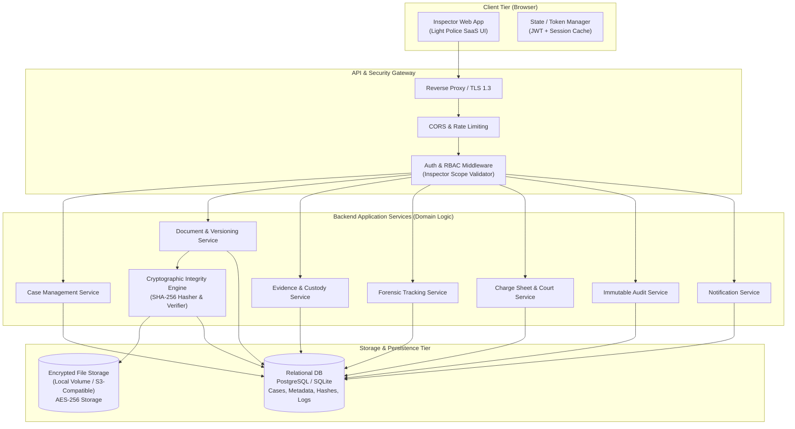
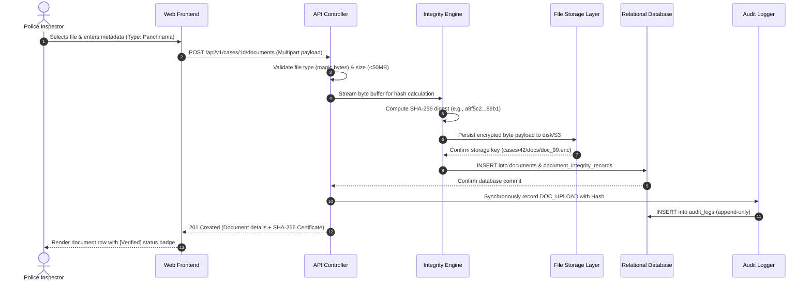
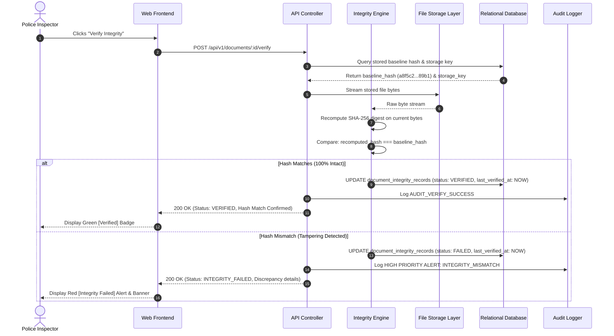
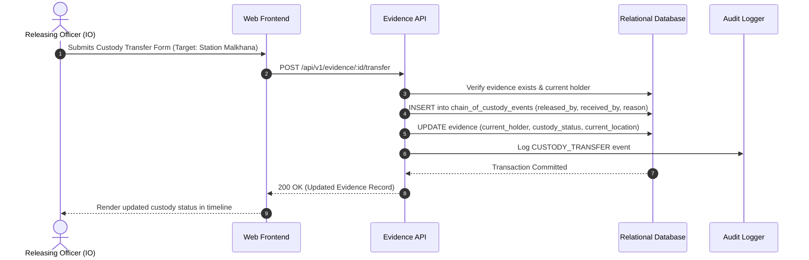

# 07. System Architecture — DocShield (SIH 26190)

```yaml
Status: CURRENT
Version: 1.0
Scope: Inspector
```

---

## 1. High-Level Architecture Overview

DocShield is structured as a **modular, multi-tier legal-grade web platform**. The architecture enforces strict separation of concerns, deterministic cryptographic integrity processing, append-only audit tracking, and high-performance relational persistence.



---

## 2. Core Architectural Components

### 2.1 Presentation Tier (Frontend)
- **Role**: Delivers the single-page Inspector application.
- **Characteristics**:
  - Horizontal top navigation layout with zero left sidebar.
  - Light-theme legal dashboard aesthetic.
  - Client-side route guard enforcing authenticated Inspector session.
  - Optimistic UI updates paired with resilient server-side cryptographic sync.
  - Native browser streaming for PDF viewing and cryptographic hash inspection.

### 2.2 Security & Gateway Tier
- **TLS Termination**: All incoming connections terminate on TLS 1.3/1.2.
- **Authentication Filter**: Verifies the cryptographically signed JWT bearer token on every protected API call.
- **RBAC Validator**: Enforces Inspector role boundaries (`POLICE_INSPECTOR`), preventing unauthorized access to external station data or administrative primitives.
- **Rate Limiting**: Protects against brute-force attempts on authentication and heavy verification endpoints.

### 2.3 Application & Domain Service Tier
- **Case Service**: Orchestrates case lifecycle, station indexing, and multi-faceted case aggregation.
- **Document & Versioning Service**: Coordinates file streams, validates MIME magic bytes, and tracks document lineage.
- **Cryptographic Integrity Engine**: Core independent component executing raw byte streaming, SHA-256 digest computation, and verification diff comparisons.
- **Evidence & Chain of Custody Service**: Manages physical/digital property records, custody transfers, and location tracking.
- **Audit Service**: Append-only event sink that records every state change, access, and cryptographic verification event synchronously.

### 2.4 Data Persistence & File Storage Tier
- **Relational Database**: Stores structured business entities, relational constraints, foreign keys, and indexes for fast queries.
- **File Storage Abstraction**: Secure disk volume or S3-compatible object store. Files are stored using deterministic hashed paths and encrypted with AES-256 at rest.

---

## 3. Critical Data Flow Pipelines

### 3.1 Document Upload, Cryptographic Hashing & Ingestion Pipeline

When an Inspector uploads a document (e.g., an FIR or Panchnama memo), the system processes the file through an atomic cryptographic pipeline:



---

### 3.2 Document Integrity Verification Pipeline

The verification pipeline allows on-demand or batch re-verification of any document against its baseline cryptographic record:



---

### 3.3 Evidence Custody Transfer Pipeline



---

## 4. Key Architectural Decisions (ADRs)

1. **Deterministic SHA-256 for Evidentiary Standard**:
   - *Rationale*: SHA-256 is globally recognized by courts, NIST, and Indian IT Act/BSA standards for digital non-repudiation.
2. **Synchronous Cryptographic Baseline Anchoring**:
   - *Rationale*: The hash must be generated *before* returning an upload success confirmation to ensure no unhashed window exists.
3. **Derived Integrity Metrics**:
   - *Rationale*: To maintain absolute judicial credibility, dashboard percentages are strictly derived from live verification state counters (`verified / total * 100`).
4. **Append-Only Immutability**:
   - *Rationale*: The `audit_logs` and `chain_of_custody_events` tables reject `UPDATE` and `DELETE` commands, guaranteeing forensic chain integrity.

---

## 5. Document Cross-References
- Product Vision: [01_PRODUCT_OVERVIEW.md](file:///d:/msi/love_you/docs/01_PRODUCT_OVERVIEW.md)
- Backend Architecture: [08_BACKEND_ARCHITECTURE.md](file:///d:/msi/love_you/docs/08_BACKEND_ARCHITECTURE.md)
- API Specification: [09_API_SPECIFICATION.md](file:///d:/msi/love_you/docs/09_API_SPECIFICATION.md)
- Database Schema: [10_DATABASE_SCHEMA.md](file:///d:/msi/love_you/docs/10_DATABASE_SCHEMA.md)
- Integrity Protocols: [13_DOCUMENT_INTEGRITY.md](file:///d:/msi/love_you/docs/13_DOCUMENT_INTEGRITY.md)
- Audit Architecture: [16_AUDIT_LOGGING.md](file:///d:/msi/love_you/docs/16_AUDIT_LOGGING.md)
