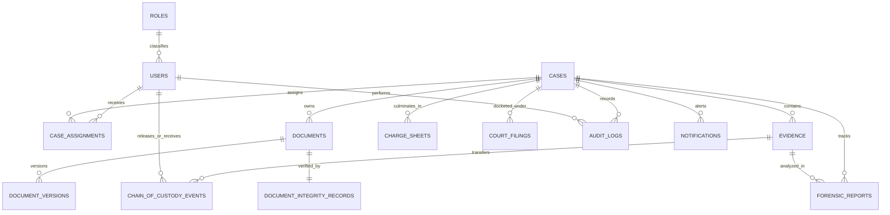

# 10. Database Schema — DocShield (SIH 26190)

```yaml
Status: CURRENT
Version: 1.0
Scope: Inspector
```

---

## 1. Schema Design Philosophy

The DocShield database schema is engineered with a **Strict Case-Centric Relational Model**. Every piece of digital documentation, physical seizure record, forensic report, charge sheet filing, cryptographic hash, and audit trail links back directly or relationally to a parent `Case` entity.

### 1.1 Structural Guarantees
1. **Case-Centric Referencing**: Disconnected or orphaned investigation items are structurally prevented via mandatory foreign key constraints (`ON DELETE RESTRICT`).
2. **Append-Only Immutability**: Historical tables (`audit_logs`, `chain_of_custody_events`, `document_integrity_records`) are append-only.
3. **Forensic Integrity Tracking**: Documents maintain separate tables for document metadata and cryptographic verification state to support re-audits without corrupting baseline records.

---

## 2. Entity-Relationship (ER) Diagram



---

## 3. Entity Definitions & Table Specifications

### 3.1 `roles`
- **Purpose**: Defines application roles (Inspector for current phase; Admin reserved for future).
- **Columns**:
  - `id` (VARCHAR(36) PK, UUID/CUID)
  - `name` (VARCHAR(50) UNIQUE NOT NULL) — e.g., `POLICE_INSPECTOR`, `SYSTEM_ADMIN`
  - `description` (VARCHAR(255))
  - `created_at` (TIMESTAMP WITH TIME ZONE DEFAULT NOW())

---

### 3.2 `users`
- **Purpose**: Represents police officers and station personnel.
- **Columns**:
  - `id` (VARCHAR(36) PK)
  - `badge_number` (VARCHAR(50) UNIQUE NOT NULL) — e.g., `INSP-BH-104`
  - `full_name` (VARCHAR(150) NOT NULL)
  - `rank` (VARCHAR(100) NOT NULL) — e.g., `Police Inspector`
  - `station_name` (VARCHAR(150) NOT NULL) — e.g., `Bhopal Central Police Station`
  - `station_code` (VARCHAR(50) NOT NULL) — e.g., `PS-BH-01`
  - `email` (VARCHAR(255) UNIQUE NOT NULL)
  - `password_hash` (VARCHAR(255) NOT NULL) — `bcrypt` / `Argon2id` hash
  - `role_id` (VARCHAR(36) FK -> `roles.id` NOT NULL)
  - `is_active` (BOOLEAN DEFAULT TRUE NOT NULL)
  - `created_at` (TIMESTAMP WITH TIME ZONE DEFAULT NOW())
  - `updated_at` (TIMESTAMP WITH TIME ZONE DEFAULT NOW())
- **Indexes**: `idx_users_badge_number`, `idx_users_station_code`.

---

### 3.3 `cases` (The Core Entity)
- **Purpose**: Master record representing an active or closed police investigation.
- **Columns**:
  - `id` (VARCHAR(36) PK)
  - `case_number` (VARCHAR(100) UNIQUE NOT NULL) — e.g., `CR-2026-BH-0042`
  - `legal_section` (VARCHAR(255) NOT NULL) — e.g., `IPC 302 / BNS 103(1)`
  - `incident_date` (TIMESTAMP WITH TIME ZONE NOT NULL)
  - `incident_location` (VARCHAR(255) NOT NULL)
  - `registration_date` (TIMESTAMP WITH TIME ZONE NOT NULL)
  - `station_code` (VARCHAR(50) NOT NULL)
  - `primary_io_id` (VARCHAR(36) FK -> `users.id` NOT NULL)
  - `complainant_name` (VARCHAR(150))
  - `description` (TEXT)
  - `status` (VARCHAR(50) NOT NULL DEFAULT 'ACTIVE') — `ACTIVE`, `UNDER_REVIEW`, `CHARGE_SHEETED`, `CLOSED`
  - `created_at` (TIMESTAMP WITH TIME ZONE DEFAULT NOW())
  - `updated_at` (TIMESTAMP WITH TIME ZONE DEFAULT NOW())
- **Indexes**: `idx_cases_case_number`, `idx_cases_status`, `idx_cases_primary_io`, `idx_cases_station`.

---

### 3.4 `case_assignments`
- **Purpose**: Maps investigating officers, assisting sub-inspectors, and station supervisory staff to a case.
- **Columns**:
  - `id` (VARCHAR(36) PK)
  - `case_id` (VARCHAR(36) FK -> `cases.id` ON DELETE RESTRICT)
  - `user_id` (VARCHAR(36) FK -> `users.id` ON DELETE RESTRICT)
  - `assignment_role` (VARCHAR(50) NOT NULL DEFAULT 'PRIMARY_IO') — `PRIMARY_IO`, `ASSISTING_OFFICER`
  - `assigned_at` (TIMESTAMP WITH TIME ZONE DEFAULT NOW())
- **Unique Constraint**: `UNIQUE(case_id, user_id)`.

---

### 3.5 `documents`
- **Purpose**: Metadata record for any digital investigation document attached to a case.
- **Columns**:
  - `id` (VARCHAR(36) PK)
  - `case_id` (VARCHAR(36) FK -> `cases.id` ON DELETE RESTRICT NOT NULL)
  - `title` (VARCHAR(255) NOT NULL)
  - `document_type` (VARCHAR(50) NOT NULL) — `FIR`, `WITNESS_STATEMENT`, `PANCHNAMA`, `MEDICAL_REPORT`, `FORENSIC_REPORT`, `CCTV_MEDIA`, `CHARGE_SHEET`, `COURT_FILING`, `OTHER`
  - `original_filename` (VARCHAR(255) NOT NULL)
  - `storage_path` (VARCHAR(500) NOT NULL) — Storage key in local/S3 store
  - `file_size_bytes` (BIGINT NOT NULL)
  - `mime_type` (VARCHAR(100) NOT NULL)
  - `uploaded_by_id` (VARCHAR(36) FK -> `users.id` NOT NULL)
  - `current_version` (INT DEFAULT 1 NOT NULL)
  - `is_active` (BOOLEAN DEFAULT TRUE NOT NULL)
  - `created_at` (TIMESTAMP WITH TIME ZONE DEFAULT NOW())
  - `updated_at` (TIMESTAMP WITH TIME ZONE DEFAULT NOW())
- **Indexes**: `idx_documents_case_id`, `idx_documents_type`, `idx_documents_active`.

---

### 3.6 `document_integrity_records` (Cryptographic Verification Engine)
- **Purpose**: Stores the cryptographic baseline digest, verification history, and tampering states.
- **Columns**:
  - `id` (VARCHAR(36) PK)
  - `document_id` (VARCHAR(36) FK -> `documents.id` ON DELETE RESTRICT NOT NULL UNIQUE)
  - `case_id` (VARCHAR(36) FK -> `cases.id` ON DELETE RESTRICT NOT NULL)
  - `algorithm` (VARCHAR(20) DEFAULT 'SHA-256' NOT NULL)
  - `baseline_hash` (CHAR(64) NOT NULL) — 64-char hexadecimal SHA-256 digest
  - `recomputed_hash` (CHAR(64)) — Hash calculated on most recent audit check
  - `status` (VARCHAR(30) DEFAULT 'VERIFIED' NOT NULL) — `VERIFIED`, `PENDING_VERIFICATION`, `INTEGRITY_FAILED`
  - `last_verified_at` (TIMESTAMP WITH TIME ZONE DEFAULT NOW())
  - `verified_by_id` (VARCHAR(36) FK -> `users.id`)
  - `verification_notes` (TEXT)
  - `created_at` (TIMESTAMP WITH TIME ZONE DEFAULT NOW())
- **Indexes**: `idx_integrity_document_id`, `idx_integrity_case_id`, `idx_integrity_status`.

---

### 3.7 `document_versions`
- **Purpose**: Preserves complete file and hash history when an investigation document is revised.
- **Columns**:
  - `id` (VARCHAR(36) PK)
  - `document_id` (VARCHAR(36) FK -> `documents.id` ON DELETE RESTRICT NOT NULL)
  - `version_number` (INT NOT NULL)
  - `storage_path` (VARCHAR(500) NOT NULL)
  - `sha256_hash` (CHAR(64) NOT NULL)
  - `file_size_bytes` (BIGINT NOT NULL)
  - `uploaded_by_id` (VARCHAR(36) FK -> `users.id` NOT NULL)
  - `revision_reason` (VARCHAR(255) NOT NULL)
  - `created_at` (TIMESTAMP WITH TIME ZONE DEFAULT NOW())
- **Unique Constraint**: `UNIQUE(document_id, version_number)`.

---

### 3.8 `evidence`
- **Purpose**: Master inventory for all physical and digital articles seized during the investigation.
- **Columns**:
  - `id` (VARCHAR(36) PK)
  - `case_id` (VARCHAR(36) FK -> `cases.id` ON DELETE RESTRICT NOT NULL)
  - `evidence_tag` (VARCHAR(100) UNIQUE NOT NULL) — Barcode / Seizure Memo ID (e.g., `EV-BH-2026-0089`)
  - `item_name` (VARCHAR(255) NOT NULL)
  - `category` (VARCHAR(50) NOT NULL) — `FIREARM`, `BLUNT_WEAPON`, `NARCOTICS`, `ELECTRONIC_MEDIA`, `DOCUMENT`, `BIOLOGICAL`, `VALUABLES`, `OTHER`
  - `seizure_date` (TIMESTAMP WITH TIME ZONE NOT NULL)
  - `seizure_location` (VARCHAR(255) NOT NULL)
  - `seized_by_id` (VARCHAR(36) FK -> `users.id` NOT NULL)
  - `witness_details` (TEXT)
  - `current_holder` (VARCHAR(150) NOT NULL) — Current custodian name/role
  - `current_location` (VARCHAR(255) NOT NULL) — Current storage vault or facility
  - `custody_status` (VARCHAR(50) DEFAULT 'IN_CUSTODY' NOT NULL) — `IN_CUSTODY`, `IN_TRANSIT`, `AT_FORENSIC_LAB`, `PRODUCED_IN_COURT`, `DISPOSED_RELEASED`
  - `is_digital` (BOOLEAN DEFAULT FALSE NOT NULL)
  - `digital_payload_doc_id` (VARCHAR(36) FK -> `documents.id` NULLABLE)
  - `created_at` (TIMESTAMP WITH TIME ZONE DEFAULT NOW())
  - `updated_at` (TIMESTAMP WITH TIME ZONE DEFAULT NOW())
- **Indexes**: `idx_evidence_case_id`, `idx_evidence_tag`, `idx_evidence_custody_status`.

---

### 3.9 `chain_of_custody_events`
- **Purpose**: Unbroken legal ledger tracking every physical/digital transfer of possession.
- **Columns**:
  - `id` (VARCHAR(36) PK)
  - `evidence_id` (VARCHAR(36) FK -> `evidence.id` ON DELETE RESTRICT NOT NULL)
  - `case_id` (VARCHAR(36) FK -> `cases.id` ON DELETE RESTRICT NOT NULL)
  - `released_by_id` (VARCHAR(36) FK -> `users.id` NOT NULL)
  - `released_by_name` (VARCHAR(150) NOT NULL)
  - `received_by_name` (VARCHAR(150) NOT NULL)
  - `receiver_badge_or_id` (VARCHAR(100) NOT NULL)
  - `transfer_reason` (VARCHAR(255) NOT NULL) — e.g., `Sent to State FSL Bhopal for Ballistic Testing`
  - `from_location` (VARCHAR(255) NOT NULL)
  - `to_location` (VARCHAR(255) NOT NULL)
  - `dispatch_memo_ref` (VARCHAR(100))
  - `transfer_timestamp` (TIMESTAMP WITH TIME ZONE DEFAULT NOW() NOT NULL)
  - `notes` (TEXT)
- **Indexes**: `idx_coc_evidence_id`, `idx_coc_case_id`, `idx_coc_timestamp`.

---

### 3.10 `forensic_reports`
- **Purpose**: Tracks Forensic Science Laboratory (FSL) requisitions, docket numbers, and scientific findings.
- **Columns**:
  - `id` (VARCHAR(36) PK)
  - `case_id` (VARCHAR(36) FK -> `cases.id` ON DELETE RESTRICT NOT NULL)
  - `evidence_id` (VARCHAR(36) FK -> `evidence.id` ON DELETE RESTRICT NOT NULL)
  - `fsl_name` (VARCHAR(255) NOT NULL) — e.g., `State Forensic Science Laboratory, Bhopal`
  - `fsl_docket_number` (VARCHAR(100) NOT NULL)
  - `requisition_date` (DATE NOT NULL)
  - `report_receipt_date` (DATE)
  - `examiner_name` (VARCHAR(150))
  - `conclusion_summary` (TEXT)
  - `report_doc_id` (VARCHAR(36) FK -> `documents.id`)
  - `status` (VARCHAR(50) DEFAULT 'REQUISITIONED' NOT NULL) — `REQUISITIONED`, `RECEIVED`, `VERIFIED`
  - `created_at` (TIMESTAMP WITH TIME ZONE DEFAULT NOW())
- **Indexes**: `idx_forensics_case_id`, `idx_forensics_evidence_id`.

---

### 3.11 `charge_sheets`
- **Purpose**: Manages final police reports under Section 173 CrPC / Section 193 BNSS.
- **Columns**:
  - `id` (VARCHAR(36) PK)
  - `case_id` (VARCHAR(36) FK -> `cases.id` ON DELETE RESTRICT NOT NULL UNIQUE)
  - `charge_sheet_number` (VARCHAR(100) UNIQUE NOT NULL)
  - `accused_list` (JSONB / TEXT NOT NULL) — Names, custody status, arrest dates
  - `charges_framed` (VARCHAR(255) NOT NULL) — Relevant IPC / BNS Sections
  - `statutory_deadline_date` (DATE NOT NULL) — 60 or 90 days from first arrest
  - `summary_of_evidence` (TEXT)
  - `filing_status` (VARCHAR(50) DEFAULT 'DRAFT' NOT NULL) — `DRAFT`, `READY_FOR_FILING`, `SUBMITTED_IN_COURT`
  - `charge_sheet_doc_id` (VARCHAR(36) FK -> `documents.id`)
  - `created_at` (TIMESTAMP WITH TIME ZONE DEFAULT NOW())
  - `updated_at` (TIMESTAMP WITH TIME ZONE DEFAULT NOW())

---

### 3.12 `court_filings`
- **Purpose**: Records judicial submissions, court hearing schedules, and magistrate orders.
- **Columns**:
  - `id` (VARCHAR(36) PK)
  - `case_id` (VARCHAR(36) FK -> `cases.id` ON DELETE RESTRICT NOT NULL)
  - `court_name` (VARCHAR(255) NOT NULL) — e.g., `Court of CJM, District Court Bhopal`
  - `presiding_judge` (VARCHAR(150))
  - `filing_date` (DATE NOT NULL)
  - `next_hearing_date` (DATE)
  - `hearing_purpose` (VARCHAR(255)) — e.g., `Arguments on Framing of Charge`
  - `order_summary` (TEXT)
  - `order_doc_id` (VARCHAR(36) FK -> `documents.id`)
  - `created_at` (TIMESTAMP WITH TIME ZONE DEFAULT NOW())
- **Indexes**: `idx_court_case_id`, `idx_court_next_hearing`.

---

### 3.13 `audit_logs` (Forensic Audit Trail)
- **Purpose**: Append-only security and operational log capturing all state changes.
- **Columns**:
  - `id` (VARCHAR(36) PK)
  - `actor_id` (VARCHAR(36) FK -> `users.id` NOT NULL)
  - `actor_badge` (VARCHAR(50) NOT NULL)
  - `action_type` (VARCHAR(50) NOT NULL) — e.g., `AUTH_LOGIN`, `CASE_CREATE`, `DOC_UPLOAD`, `DOC_VERIFY`, `EVIDENCE_LOG`, `CUSTODY_TRANSFER`
  - `resource_type` (VARCHAR(50) NOT NULL) — `CASE`, `DOCUMENT`, `EVIDENCE`, `FORENSIC_REPORT`, `CHARGE_SHEET`
  - `resource_id` (VARCHAR(36) NOT NULL)
  - `case_id` (VARCHAR(36) FK -> `cases.id` NULLABLE)
  - `ip_address` (VARCHAR(45) NOT NULL)
  - `user_agent` (VARCHAR(255) NOT NULL)
  - `metadata_diff` (JSONB / TEXT) — Captured snapshot of payload / change
  - `created_at` (TIMESTAMP WITH TIME ZONE DEFAULT NOW() NOT NULL)
- **Indexes**: `idx_audit_case_id`, `idx_audit_actor_id`, `idx_audit_timestamp`.

---

### 3.14 `notifications`
- **Purpose**: Stores operational alerts, verification notices, and deadline reminders for the Inspector.
- **Columns**:
  - `id` (VARCHAR(36) PK)
  - `recipient_id` (VARCHAR(36) FK -> `users.id` NOT NULL)
  - `case_id` (VARCHAR(36) FK -> `cases.id` NULLABLE)
  - `title` (VARCHAR(255) NOT NULL)
  - `message` (TEXT NOT NULL)
  - `priority` (VARCHAR(20) DEFAULT 'NORMAL' NOT NULL) — `LOW`, `NORMAL`, `HIGH`, `CRITICAL`
  - `is_read` (BOOLEAN DEFAULT FALSE NOT NULL)
  - `created_at` (TIMESTAMP WITH TIME ZONE DEFAULT NOW() NOT NULL)
- **Indexes**: `idx_notif_recipient_unread` (`recipient_id`, `is_read`).

---

## 4. Document Cross-References
- System Architecture: [07_SYSTEM_ARCHITECTURE.md](file:///d:/msi/love_you/docs/07_SYSTEM_ARCHITECTURE.md)
- Backend Architecture: [08_BACKEND_ARCHITECTURE.md](file:///d:/msi/love_you/docs/08_BACKEND_ARCHITECTURE.md)
- API Specification: [09_API_SPECIFICATION.md](file:///d:/msi/love_you/docs/09_API_SPECIFICATION.md)
- Cryptographic Integrity: [13_DOCUMENT_INTEGRITY.md](file:///d:/msi/love_you/docs/13_DOCUMENT_INTEGRITY.md)
- Chain of Custody: [15_CHAIN_OF_CUSTODY.md](file:///d:/msi/love_you/docs/15_CHAIN_OF_CUSTODY.md)
