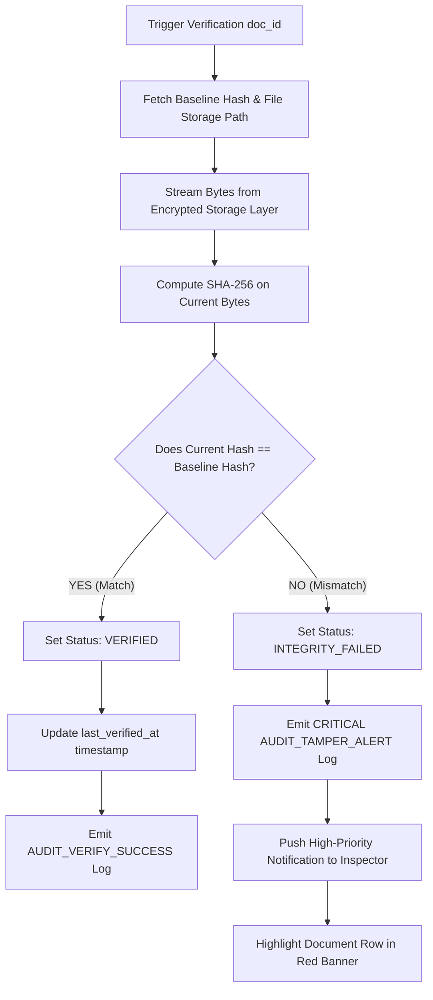

# 13. Document Integrity & Cryptographic Engine — DocShield (SIH 26190)

```yaml
Status: CURRENT
Version: 1.0
Scope: Inspector
```

---

## 1. Executive Summary & Forensic Standard

The Document Integrity Engine is the cryptographic trust core of DocShield. In criminal jurisprudence, electronic records are admissible under Section 65B of the Indian Evidence Act (and Section 63 of Bharatiya Sakshya Adhiniyam, BSA 2023) only when accompanied by unimpeachable proof of authenticity, chain of custody, and freedom from mechanical or digital tampering.

DocShield replaces arbitrary trust with **deterministic cryptographic non-repudiation** using the **Secure Hash Algorithm 256-bit (SHA-256)** standard.

---

## 2. Integrity Status Model

Every document in DocShield exists in exactly one of four mutually exclusive integrity states:

```
[ NOT_UPLOADED ] ──> (File Ingestion) ──> [ VERIFIED ]
                                                 │
                   ┌─────────────────────────────┴─────────────────────────────┐
                   ▼                                                           ▼
       (Re-verification Match)                                     (Byte Mismatch Detected)
           [ VERIFIED ]                                               [ INTEGRITY_FAILED ]
                   ▲                                                           │
                   └────────────────── (Admin / Escalation) ───────────────────┘
```

| Integrity Status | Color Token | Visual Badge | Operational Meaning |
| :--- | :--- | :--- | :--- |
| **`VERIFIED`** | Status Emerald (`#059669`) | `[ 🛡️ Verified ]` | The recomputed cryptographic hash matches the original baseline hash bit-for-bit. File is pristine and unaltered. |
| **`PENDING_VERIFICATION`**| Status Amber (`#D97706`) | `[ ⏳ Pending ]` | Document has been uploaded or queued for re-verification, but the verification run has not completed. |
| **`INTEGRITY_FAILED`** | Status Rose (`#DC2626`) | `[ ⚠️ Integrity Failed ]` | **CRITICAL ALERT**: The recomputed SHA-256 digest does not match the baseline hash. Potential file corruption or malicious tampering detected. |
| **`NOT_UPLOADED`** | Neutral Slate (`#64748B`) | `[ ⚪ Not Uploaded ]` | Document slot exists (e.g., placeholder for final charge sheet), but no binary file has been uploaded yet. |

---

## 3. Cryptographic Implementation Details

### 3.1 Hash Generation Pipeline
When an Inspector uploads a file:
1. The raw binary stream is piped directly into a cryptographic hashing stream without buffering the entire payload into unmanaged memory:
   ```javascript
   // Architectural Reference Implementation
   const crypto = require('crypto');
   const fs = require('fs');

   function calculateFileHash(stream) {
     return new Promise((resolve, reject) => {
       const hash = crypto.createHash('sha256');
       stream.on('data', chunk => hash.update(chunk));
       stream.on('end', () => resolve(hash.digest('hex')));
       stream.on('error', err => reject(err));
     });
   }
   ```
2. The generated 64-character hexadecimal digest (256 bits) is immutably committed into the `document_integrity_records` table:
   ```sql
   INSERT INTO document_integrity_records (
     id, document_id, case_id, algorithm, baseline_hash, status, last_verified_at
   ) VALUES (
     'int_01J8F3', 'doc_9921', 'case_01J8F3', 'SHA-256', 
     'a8f5c2d3e4b5a6c7d8e9f0123456789abcdef0123456789abcdef0123456789a', 
     'VERIFIED', NOW()
   );
   ```

---

## 4. Integrity Verification & Tamper Detection Routine

Verification can be executed **on-demand** by an Inspector clicking `Verify Integrity`, or systematically via scheduled background integrity audits.

### 4.1 Verification Algorithm


### 4.2 Tamper Simulation & Detection Logic
Even if a single byte, bit, or timestamp in a 40 MB video or PDF file is modified by an unauthorized database or storage operator:
- Original Baseline: `a8f5c2d3e4b5a6c7d8e9f0123456789abcdef0123456789abcdef0123456789a`
- Tampered File Hash: `3e819b22dc58e0f14a78129cae1423851b4c3e8093817498c2130e54b68ef821`
- **Result**: `match === false` ➔ Status immediately locks to `INTEGRITY_FAILED`.

---

## 5. Mathematical Calculation of Integrity Verified %

> [!IMPORTANT]
> **Zero Arbitrary Percentages**: DocShield strictly rejects hardcoded or cosmetic metrics. The platform-wide and case-level **Integrity Verified Percentage** displayed on the Inspector Dashboard is derived exclusively from real-time database counts.

### 5.1 The Integrity Metric Formula
$$\text{Integrity Verified \%} = \left( \frac{N_{\text{verified}}}{N_{\text{active\_uploaded}}} \right) \times 100$$

Where:
- $N_{\text{verified}}$ = Count of all active documents having `status = 'VERIFIED'` and associated with authorized active cases.
- $N_{\text{active\_uploaded}}$ = Total count of all active documents with uploaded binary payloads (i.e. excluding `NOT_UPLOADED` placeholders).

### 5.2 Deterministic SQL Implementation
```sql
SELECT 
  COUNT(CASE WHEN ir.status = 'VERIFIED' THEN 1 END) AS verified_count,
  COUNT(CASE WHEN ir.status = 'PENDING_VERIFICATION' THEN 1 END) AS pending_count,
  COUNT(CASE WHEN ir.status = 'INTEGRITY_FAILED' THEN 1 END) AS failed_count,
  COUNT(d.id) AS total_uploaded_documents,
  ROUND(
    (COUNT(CASE WHEN ir.status = 'VERIFIED' THEN 1 END)::numeric / 
     NULLIF(COUNT(d.id), 0)::numeric) * 100.0, 
    2
  ) AS integrity_percentage
FROM documents d
JOIN document_integrity_records ir ON d.id = ir.document_id
WHERE d.is_active = TRUE;
```

### 5.3 UI Display Mapping
- **If 126 out of 128 documents are verified**:
  $$\frac{126}{128} \times 100 = 98.44\%$$
  - Display: `98.4%` in the top KPI card.
  - Subtext: `126/128 Verified (2 Pending)`.
  - Color: Emerald if 100%, Amber if pending items exist, High-Contrast Red if `failed_count > 0`.

---

## 6. Version Integrity & Immutability Guarantees

When a document version is revised:
1. The new file version receives its own dedicated SHA-256 calculation and row in `document_versions`.
2. The original version's hash and verification history remain permanently preserved in the database.
3. Historical audit trails continue to link back to the exact version hash present at the time of each historical inspection.

---

## 7. Document Cross-References
- Product Overview: [01_PRODUCT_OVERVIEW.md](file:///d:/msi/love_you/docs/01_PRODUCT_OVERVIEW.md)
- Inspector Workflow: [03_INSPECTOR_WORKFLOW.md](file:///d:/msi/love_you/docs/03_INSPECTOR_WORKFLOW.md)
- API Specification: [09_API_SPECIFICATION.md](file:///d:/msi/love_you/docs/09_API_SPECIFICATION.md)
- Database Schema: [10_DATABASE_SCHEMA.md](file:///d:/msi/love_you/docs/10_DATABASE_SCHEMA.md)
- Audit Logging: [16_AUDIT_LOGGING.md](file:///d:/msi/love_you/docs/16_AUDIT_LOGGING.md)
