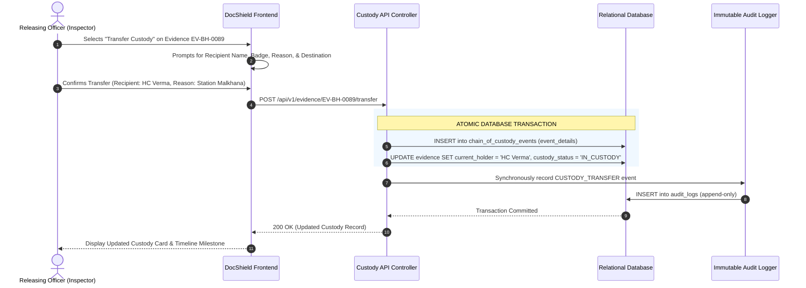

# 15. Chain of Custody (CoC) — DocShield (SIH 26190)

```yaml
Status: CURRENT
Version: 1.0
Scope: Inspector
```

---

## 1. Evidentiary & Legal Foundation

In legal proceedings, the **Chain of Custody (CoC)** is the chronological paper and digital trail documenting the **seizure, custody, control, transfer, analysis, and disposition of physical and electronic evidence**. Under Sections 65B/63 of the Indian Evidence Act (BSA 2023), any unexplained gap in possession, missing dispatch memo, or unrecorded custodian change can lead to evidence suppression and acquittal of the accused.

DocShield eliminates custodial discrepancies by providing an **immutable, mathematically verifiable, tamper-evident digital custody ledger**.

```
┌─────────────────────────────────────────────────────────────────────────────────────────────────┐
│                                 CHRONOLOGICAL CUSTODY PROVENANCE                                │
├──────────────────┬──────────────────┬────────────────────┬─────────────────┬────────────────────┤
│ 1. SEIZURE       │ 2. STATION VAULT │ 3. FSL DISPATCH    │ 4. LAB ANALYSIS │ 5. COURT EXHIBIT   │
│ Seized by IO at  │ Deposited with   │ Handed to Courier  │ Received by FSL │ Produced before    │
│ Crime Scene      │ Malkhana Officer │ Constable for Lab  │ Ballistic Expert│ CJM Magistrate     │
│ [22 Sep, 22:15]  │ [23 Sep, 09:30]  │ [24 Sep, 11:00]    │ [24 Sep, 15:45] │ [02 Oct, 10:30]    │
└──────────────────┴──────────────────┴────────────────────┴─────────────────┴────────────────────┘
```

---

## 2. Core Chain of Custody Data Fields

Every custody transfer committed via `POST /api/v1/evidence/:id/transfer` captures complete provenance details:

| Field Name | Type | Description & Legal Context |
| :--- | :--- | :--- |
| `id` | UUID/CUID | Unique custody transfer event identifier. |
| `evidence_id` | Foreign Key | The exact physical or digital evidence item transferred. |
| `case_id` | Foreign Key | The parent investigation case. |
| `released_by_id` | Foreign Key | Authenticated user ID of the releasing officer. |
| `released_by_name`| String | Official name and rank of the releasing officer (e.g., `Insp. A. Sharma`). |
| `received_by_name`| String | Full name and rank of the recipient (e.g., `HC R. Verma, Malkhana Moharrir`). |
| `receiver_badge` | String | Official badge, employee ID, or institutional identifier of the receiver. |
| `transfer_reason` | Enum / String | Statutory justification (`Vault Safekeeping`, `Forensic Analysis`, `Court Production`). |
| `from_location` | String | Source physical facility/room (`IO Investigation Locker`, `Malkhana Vault #2`). |
| `to_location` | String | Destination physical facility (`State FSL Laboratory, Bhopal`). |
| `dispatch_memo_ref`| String | Official police road certificate / Malkhana register entry number. |
| `transfer_timestamp`| ISO Timestamp | Exact timestamp recorded from server clock (NTP-synchronized). |
| `notes` | Text | Observations regarding package seal condition (e.g., `Wax seal intact`). |

---

## 3. The Custody Lifecycle & Transfer Workflow



---

## 4. Immutability & Anti-Tampering Rules

To satisfy strict evidentiary standards:
1. **Append-Only Immutability**: The `chain_of_custody_events` table enforces `NO UPDATE` and `NO DELETE` rules via database constraints. Once a transfer is committed, it can never be rewritten or wiped.
2. **Sequential Integrity**: The backend enforces that an officer cannot release an evidence item unless they are currently recorded as its legitimate holder or have jurisdictional supervisory authority.
3. **Audit Cross-Anchoring**: Every transfer event synchronously writes a corresponding entry into `audit_logs`, enabling judicial cross-verification between the custody ledger and system security telemetry.

---

## 5. Case-Centric and Evidence-Centric UI Visualizations

### 5.1 Case-Level Custody Timeline
Within `/cases/:id?tab=custody`, the Inspector views a unified chronological feed displaying every transfer across all evidence items belonging to that case.

### 5.2 Evidence Detail Custody Drawer
Clicking on an individual evidence item opens an interactive possession drawer displaying:
```
● 24 Sep 2026, 11:00 AM — Handed over for Forensic Analysis
  Released By: Insp. A. Sharma (IO) [Badge: INSP-BH-104]
  Received By: Constable Manoj Kumar (FSL Courier) [Badge: CT-BH-882]
  From: Bhopal Central PS Malkhana ➔ To: State FSL Bhopal
  Reason: Ballistic striation and firing pin analysis
  Road Certificate: RC-2026-BH-410 | Wax Seal: INTACT
─────────────────────────────────────────────────────────────
● 23 Sep 2026, 09:30 AM — Transferred to Station Malkhana
  Released By: Insp. A. Sharma (IO) [Badge: INSP-BH-104]
  Received By: HC R. Verma (Malkhana Moharrir) [Badge: HC-BH-442]
  From: IO Investigation Desk ➔ To: Malkhana Vault Room 2
  Reason: Safe custodial storage
─────────────────────────────────────────────────────────────
● 22 Sep 2026, 22:15 PM — Seizure at Crime Scene
  Seized By: Insp. A. Sharma [Badge: INSP-BH-104]
  Location: Alleyway behind Sector B Market, Bhopal
  Witnesses: Suresh Patil, Amit Kushwaha (Panchnama Signed)
```

---

## 6. Judicial Export & Certification (Section 65B/63 Certificate)

DocShield allows the Inspector to generate a certified **Evidence Seizure & Chain of Custody Certificate** (PDF) at any time. This certificate compiles:
- Complete item description and photographs.
- Full unbroken possession timeline with dates, badge numbers, and transfer reasons.
- Cryptographic hash proof (for digital articles).
- Official police seal and automated timestamp signature.

---

## 7. Document Cross-References
- Product Vision: [01_PRODUCT_OVERVIEW.md](file:///d:/msi/love_you/docs/01_PRODUCT_OVERVIEW.md)
- Evidence Management: [14_EVIDENCE_MANAGEMENT.md](file:///d:/msi/love_you/docs/14_EVIDENCE_MANAGEMENT.md)
- Database Schema: [10_DATABASE_SCHEMA.md](file:///d:/msi/love_you/docs/10_DATABASE_SCHEMA.md)
- Audit Logging: [16_AUDIT_LOGGING.md](file:///d:/msi/love_you/docs/16_AUDIT_LOGGING.md)
- Case Dossier Reporting: [20_REPORTING.md](file:///d:/msi/love_you/docs/20_REPORTING.md)
