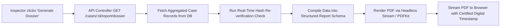

# 20. Reporting & Dossier Generation — DocShield (SIH 26190)

```yaml
Status: CURRENT
Version: 1.0
Scope: Inspector
```

---

## 1. Overview & Judicial Context

In law enforcement, investigation data compiled across digital portals must ultimately be translated into physical, printable, or cryptographically certified digital formats for prosecution and judicial review.

Under the Code of Criminal Procedure (CrPC) and Bharatiya Nagarik Suraksha Sanhita (BNSS), an Investigating Officer (Inspector) must submit structured reports to the Public Prosecutor and the Jurisdictional Magistrate.

DocShield provides a **Case-Centric Reporting Engine** capable of compiling and rendering official investigation dossiers with embedded cryptographic proofs.

---

## 2. Core Inspector Reports

DocShield defines 7 standardized case-centric reports:

| Report Identifier | Official Title | Evidentiary Purpose | Target Audience |
| :--- | :--- | :--- | :--- |
| **`REP-CASE-SUMMARY`** | **Complete Case Diary Summary** | Comprehensive summary of the crime, investigation timeline, and witness depositions. | Public Prosecutor / SP |
| **`REP-DOC-INVENTORY`**| **Document Inventory & Verification Log** | Full ledger of all attached documents with original filenames, sizes, and upload timestamps. | Judicial Court Clerk |
| **`REP-EVIDENCE-LEDGER`**| **Evidence Seizure & Property Schedule** | Formal schedule of all physical and digital articles seized under Panchnama. | Trial Court / Malkhana |
| **`REP-COC-CERT`** | **Chain of Custody Certificate** | Chronological record of evidence handovers complying with evidence law. | Defense & Trial Court |
| **`REP-INTEGRITY-CERT`**| **Section 65B/63 Electronic Record Certificate** | Cryptographic certificate listing SHA-256 hashes, algorithm details, and tamper checks. | Presiding Magistrate |
| **`REP-FORENSIC-SUMMARY`**| **Forensic Analysis & FSL Report Summary** | Consolidation of scientific findings (ballistics, DNA, toxicology, cyber). | Prosecutor / Expert |
| **`REP-CHARGE-SHEET`** | **Final Report (Sec 173 CrPC / 193 BNSS)** | Statutory charge sheet summarizing accused charges and documentary exhibits. | Judicial Magistrate |

---

## 3. The Flagship Dossier: Certified Case Dossier

The primary deliverable of the reporting engine is the **Master Case Dossier (PDF)**, generated via `GET /api/v1/cases/:id/report/dossier`.

### 3.1 Structure of the Generated Dossier:
1. **Title Page & Official Header**:
   - State Police Emblem, Precinct Name (`Bhopal Central Police Station`).
   - Crime No (`CR-2026-BH-0042`), Sections of Offense (`IPC 302 / BNS 103(1)`).
   - Primary Investigating Officer: `Insp. A. Sharma [Badge: INSP-BH-104]`.
2. **Investigation Narrative**:
   - Date, Time, and Location of Crime.
   - Initial Information / Complainant statement summary.
3. **Document Schedule & Cryptographic Hash Table**:
   ```
   ┌────────────────────────────────────────────────────────────────────────────────────────┐
   │ DOCUMENT TITLE          TYPE         UPLOAD DATE        SHA-256 BASELINE HASH   STATUS │
   ├────────────────────────────────────────────────────────────────────────────────────────┤
   │ FIR_Form_154.pdf        FIR          23 Sep 2026, 01:15 a8f5c2d...89b1          VERIFIED│
   │ Panchnama_Scene_01.pdf  PANCHNAMA    23 Sep 2026, 05:30 7b8d4e9...6a7b          VERIFIED│
   │ Statement_Witness_1.pdf STATEMENT    23 Sep 2026, 08:20 3c91a0f...11f2          VERIFIED│
   └────────────────────────────────────────────────────────────────────────────────────────┘
   ```
4. **Schedule of Seized Evidence & Unbroken Chain of Custody**:
   - Item tags, seizure witnesses, and full handover history (Releasing Officer -> Recipient -> Reason).
5. **Forensic Examination Findings**:
   - Summary of FSL reports with docket numbers and ballistic/chemical match confirmations.
6. **Statutory Electronic Record Verification Statement**:
   - Standard declaration under Section 65B Indian Evidence Act / Section 63 BSA:
     *"I, Insp. A. Sharma, do hereby certify that the electronic documents listed herein have been generated, ingested, and stored under strict cryptographic controls using SHA-256 digests with zero unrecorded alterations."*

---

## 4. Technical Generation & Rendering Pipeline



- **Zero Arbitrary Data**: Every hash, timestamp, and custody step in the generated report is pulled directly from immutable relational tables.
- **Client-Side Print Support**: Clean CSS print stylesheets (`@media print`) ensure that when an Inspector prints directly from the web interface, non-essential top-navigation elements are hidden, leaving a pristine police document.

---

## 5. Document Cross-References
- Product Vision: [01_PRODUCT_OVERVIEW.md](file:///d:/msi/love_you/docs/01_PRODUCT_OVERVIEW.md)
- Inspector Workflow: [03_INSPECTOR_WORKFLOW.md](file:///d:/msi/love_you/docs/03_INSPECTOR_WORKFLOW.md)
- Cryptographic Integrity: [13_DOCUMENT_INTEGRITY.md](file:///d:/msi/love_you/docs/13_DOCUMENT_INTEGRITY.md)
- Chain of Custody: [15_CHAIN_OF_CUSTODY.md](file:///d:/msi/love_you/docs/15_CHAIN_OF_CUSTODY.md)
