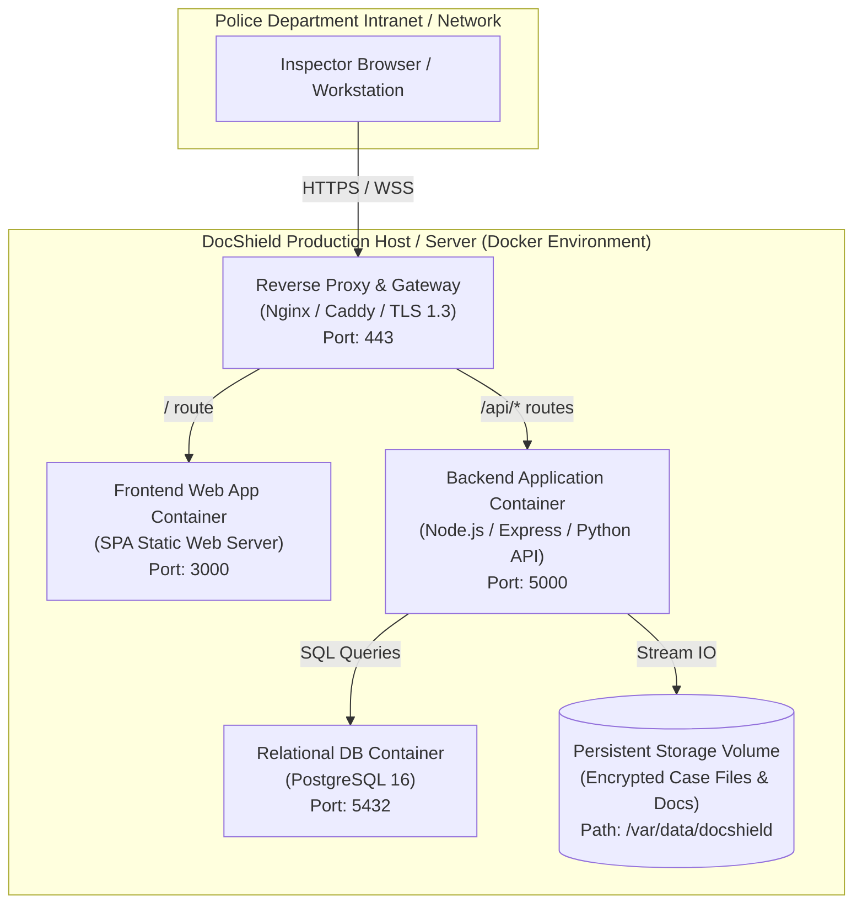

# 23. Deployment & Operational Architecture — DocShield (SIH 26190)

```yaml
Status: CURRENT
Version: 1.0
Scope: Inspector
```

---

## 1. Deployment Topology Overview

DocShield is engineered as a **containerized, self-contained, micro-deployable system**. It can be deployed in a secure on-premises police intranet server, a state police private data center, or an isolated GovCloud environment (e.g., NIC / MeghRaj).



---

## 2. Containerized Architecture & Services

The platform consists of four standardized containerized services orchestrated via Docker Compose:

1. **Reverse Proxy (Gateway)**:
   - Terminates TLS 1.3, manages CORS, sets strict HTTP security headers, and routes `/api` traffic to the backend and `/` traffic to the frontend.
2. **Frontend Service**:
   - Lightweight container serving the compiled single-page Inspector application.
3. **Backend API Service**:
   - Application logic server executing the cryptographic hashing engine, REST controllers, and audit workers.
4. **Relational Database Service**:
   - PostgreSQL 16 container with automated initialization scripts, relational schemas, foreign keys, and immutability triggers.

---

## 3. Environment Variables & Secret Configuration

Configuration is passed via environment variables (never checked into source control):

```env
# ==========================================
# DocShield Core Environment Configuration
# ==========================================
NODE_ENV=production
PORT=5000
APP_URL=https://docshield.police.gov.in

# Database Configuration
DATABASE_URL=postgresql://docshield_user:<secure_db_password>@db:5432/docshield_db?sslmode=require
DB_POOL_MIN=5
DB_POOL_MAX=20

# JWT & Authentication Secrets
JWT_SECRET=<generate_secure_random_64_char_secret>
JWT_EXPIRES_IN=15m
REFRESH_TOKEN_SECRET=<generate_secure_random_64_char_secret>
REFRESH_TOKEN_EXPIRES_IN=7d

# File Storage Configuration
STORAGE_DRIVER=local               # 'local' or 's3'
LOCAL_STORAGE_PATH=/var/data/docshield/cases
MAX_UPLOAD_SIZE_BYTES=52428800     # 50 MB in bytes
STORAGE_ENCRYPTION_KEY=<generate_secure_32_byte_aes_key>

# Jurisdictional Defaults
DEFAULT_STATION_CODE=PS-BH-01
DEFAULT_STATION_NAME="Bhopal Central Police Station"
```

---

## 4. Build & Production Deployment Pipeline

### 4.1 Production Build Commands
```bash
# 1. Build and Bundle Frontend
cd frontend
npm ci
npm run build

# 2. Build Backend Application
cd ../backend
npm ci
npm run build

# 3. Launch System via Docker Compose
cd ..
docker-compose -f docker-compose.prod.yml up -d --build
```

### 4.2 Database Migration & Schema Seeding
Upon initial startup:
```bash
# Execute DDL migrations
npm run db:migrate

# Seed baseline Inspector accounts & stations
npm run db:seed
```

---

## 5. Backup, Disaster Recovery & Telemetry

1. **Database Snapshot Backups**:
   - Automated nightly `pg_dump` backup saved to an isolated secondary backup disk.
   ```bash
   pg_dump -U docshield_user docshield_db | gzip > /var/backups/docshield_$(date +%Y%m%d).sql.gz
   ```
2. **Encrypted Storage Synchronization**:
   - Daily rsync of `/var/data/docshield` to secure off-site archive.
3. **Application Telemetry**:
   - Winston / Pino structured JSON logging writing to standard output.
   - Centralized health-check endpoint: `GET /api/v1/health` verifying DB connectivity, storage writeability, and memory headroom.

---

## 6. Document Cross-References
- System Architecture: [07_SYSTEM_ARCHITECTURE.md](file:///d:/msi/love_you/docs/07_SYSTEM_ARCHITECTURE.md)
- Backend Architecture: [08_BACKEND_ARCHITECTURE.md](file:///d:/msi/love_you/docs/08_BACKEND_ARCHITECTURE.md)
- Security Architecture: [18_SECURITY_ARCHITECTURE.md](file:///d:/msi/love_you/docs/18_SECURITY_ARCHITECTURE.md)
- Project Structure: [24_PROJECT_STRUCTURE.md](file:///d:/msi/love_you/docs/24_PROJECT_STRUCTURE.md)
